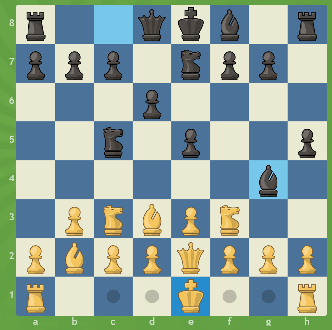

# Chapter 7 Labs

## Chess

This exercise involves the well-known strategy game of chess. If you aren't familiar with the basic rules or just need some review, refer to [this page](https://en.wikipedia.org/wiki/Chess#Movement) (Note that this lab doesn't require knowledge of some more advanced rules like *en passant*). 

### Overview

Before beginning, there are some important details regarding the game software implementation you may need to know. Each game has its own `GameLoop` which coordinates the basic turn-by-turn operation of the game. The loop maintains several components including two `Player`s, one `Board`, and one `GameWindow`. The `GameWindow` contains some code for the graphical portion of the codebase; its implementation is unimportant and will be disregarded. `Player` instances represent either human or computer players. Each `Player` has a `makeMove()` method that takes both a `Board` and the last opponent `Move` and returns its `Move`. 

The `Board` is a more complex entity that holds the entire state of the game at any given moment. This includes a 2D array of `Piece`s. Each piece has its own internal logic that describes how it moves stores its `Color` (white or black). (Side note: In the code, colors are represented using a new kind of Java entity called an enum. If you're curious, you can read more about enums [here](https://docs.oracle.com/javase/tutorial/java/javaOO/enum.html).) The `Board` class also has some useful methods that can detect checkmate and remove invalid moves (e.g. moves that keep/put the current player in check) among other things. 

To see all of this working in action, run the `Main.java` file. This starts up a human-human player game (we'll learn later how to change the players). At this point, a window should pop up with an 8x8 checkered grid and some pieces.

### Board Setup

Your first task is to properly setup the initial configuration of the board. To do this, you will need to add additional lines in the constructor for the `Board` class to populate the `pieces` 2D array. Note that the board is indexed in row-major order with (0,0) being the top left cell and (7,7) being the bottom right cell in the game window.

### Basic Movement

Your second task is to program the movement of each of the pieces. All pieces must extend the `Piece` class. This abstract class has a single abstract method, `getValidMoves()` that returns a list of valid moves given the current `Board`. This method returns a `List<Move>` where `Move`s are merely simple objects that have a start and end location. To help you out, I've written the basic skeleton for each of the piece subclasses and (mostly) implemented the `Pawn` class. Despite their apparent simplicity, the movement logic for pawns is rather complicated given the asymmetry of their movements. Make sure to carefully study its`getValidMoves()` method and try to understand how it all works.

Please fill out the `getValidMoves()` method for the `Knight`, `Bishop`,`Rook`,`Queen`, and `King` classes. When you're finished, you should be able to spin up a new game and play. **When you finish, please write out the class definition (you may omit the package and imports) for two of the piece subclasses you've implemented with proper indentation and formatting.**

### Mirror Player

Now that you have a working game framework, you're ready to make a simple computer player. To do this, make a new class `MirrorPlayer` that extends `Player`. The goal of this player is to exactly mirror the opponent's plays move-by-move. For example, if the human player moves its queen's pawn forward one square, the mirror player should do the same with its queen's pawn. You may safely assume that the `MirrorPlayer` will always be black. Additionally, the player doesn't need to check that the move it makes is valid so long as it is an exact mirror of white's last move (this may cause an error popup; don't worry about it).

To switch out one of the human players for your `MirrorPlayer`, replace the black player in the `GameLoop` constructor in `Main.java`. Notice how the flexibility of the `Player` type structure allows for different players to be easily interchanged. 

### Promotion

In addition to the normal rules, chess has some special rules that only apply in specific situations. In this exercise, we will explore one of them: promotion. Basically, when a pawn reaches the other side of the board, it can be promoted to another piece of the same color (e.g. a queen) other than a pawn. 

Your task is to implement promotion in our chess program. To make things easier, pawns will automatically be promoted to a queen in lieu of having players choose the desired promotion. To do this, you will have to create a custom move by creating a new class that implements `Move` **and has an appropriate `equals()` method**. Please read the Javadoc comments (and notice their formatting!) for each of the methods in the `Move` interface to make sure you're implementing them properly. After you've finished, add some more logic to the `Pawn` class to make sure it uses the new, custom promotion move instead of `SimpleMove` when appropriate.

### Castling

Castling is another special rule in chess. If you are unfamiliar with it or need a refresher, use the link in the first section.

Your task is to implement castling in our program. As with promotion, we will also be modifying the rule slightly to fit our purposes. In this case, the king may castle if the king and/or the corresponding rook have moved (so long as they are still in the proper spot). The other subtle rules of castling still apply though; for example, the king may not castle through nor into check. One more thing to note is that castling is shown as one of the king's moves (not the rooks'). For example, the two outside moves of the white king correspond to queenside and kingside castling:

To accomplish this, you will need to create another custom move similar to promotion. This is by far the hardest task for this lab; take your time and try not to get too frustrated. Good luck!